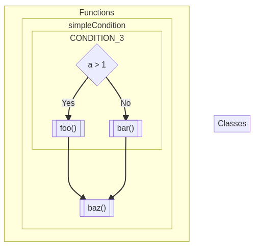
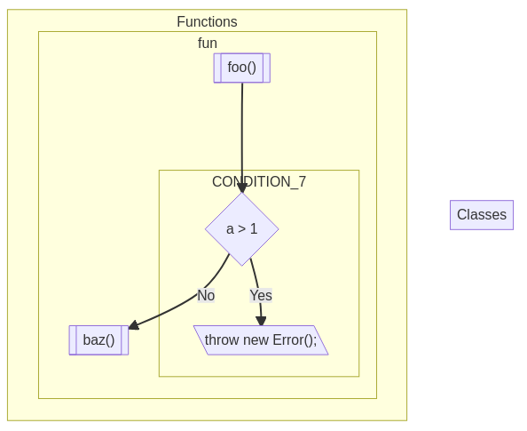
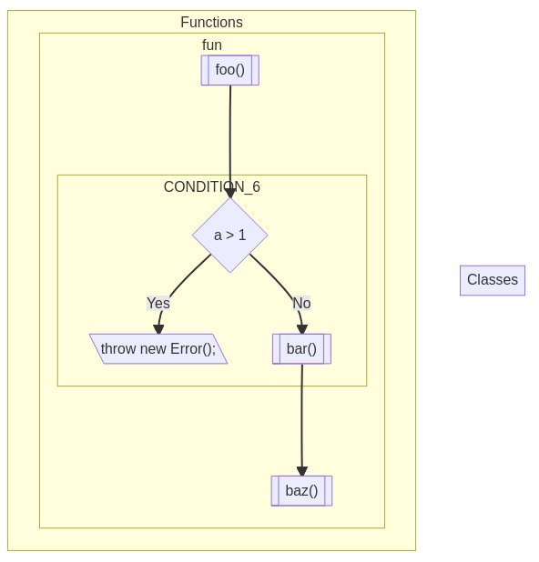
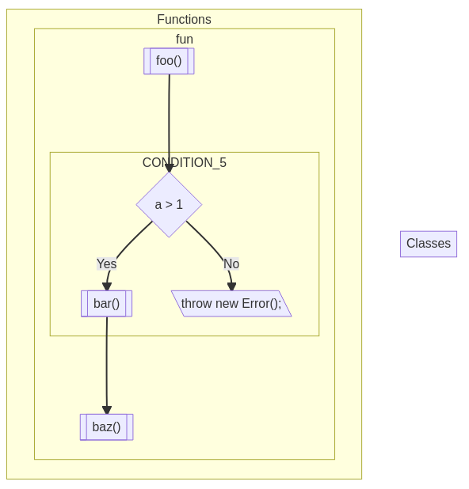

# Conditions

## Example of rendered simple _condition_ with functions before and after

## Example of rendered _condition_ withhout _else_

## Example of rendered _condition_ with _throw_ when positive without continue

## Example of rendered _condition_ with _throw_ when positive

## Example of rendered _condition_ with _throw_ when negative

